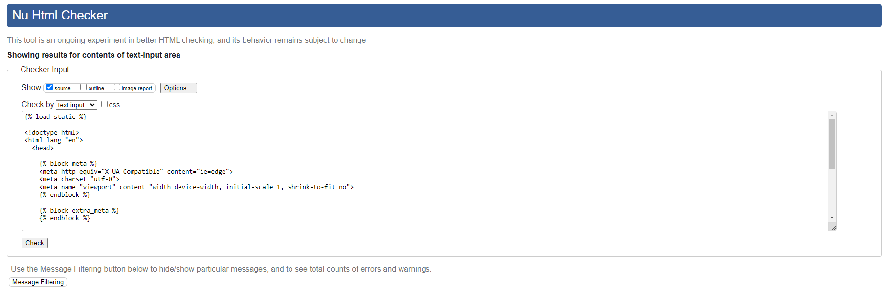

# Yoga_shop

## Milestone Project 4

This is my very First E-Commerce Website.
HEAVENLY Yoga Shop is about the Youg and Meditation Products Online Store. Where people can buy Ypga and Meditations Products.

## Live Project 

 
Heavenly Yoga Shop app can be found at (https://yoga-shop-8f3af1e13c14.herokuapp.com/)

 

## Repository  

(Project repository here)  
https://github.com/Killol14/Yoga_shop.git
 

## Table of Contents  

* User Experience

1.User stories

* Wireframes 

* Design  

1.Font Style  

2.Colour Scheme  

3.Images and Icons  

* Structure  

1.Navigation Bar  

2.Social Media Links (Footer)  

3.Places in India Page

* Features  

1.Current Features 

* Technologies Used  

1.Languages used  

2.Frameworks and Library Programs  

* Testing  

* Other Tolls

* Deployment  

1. GitHub Pages  

* Credits  

1.Code  

2.Media  

3.Content  

4.Acknowledgements  

* Summary  
---------------------------------------------------------------------------------------------------

## User Experience

* 
* Make it easy for the user to navigate the site.

## User Stories 
* As a user I want to easily look for different travel tips and advice for travelling to India
* As a user I want to search for specific activities and tips when travelling 
* As a user I want to able to look for tips sorted through categories 
* As a user I want to be able to register my own account
* As a user I want to be able to log in to my account
* As a user I want to be able to log out of my account
* As a user I want to upload my own stories/tips and advice 
* As a user I want to be able to edit my travel contribution tips 
* As a user I want to be able to delete my travel contribution tips 
* As a site admin I want to be able to add new categories to the site
* As a site admin I want to be able to edit categories
* As a site admin I want to be able to delete categories

## Wireframes  

### Roaming In India Page

### Ipad View

### Phone View

## Design 
With the user in mind, I wanted to create a website that travellers can easily search, add and amend different activities and tips about travelling to India. I used a simplisitic style with cards that show pictures of the place visited, and also drop down menu where the user can add into the specific category. 

## Colour Scheme  

I chose this colour scheme for simplicity of Website.

.png)

## Images  

As this website is based on India, I have included images of the country in order to show the diverse aesthetic of India.  

The front page has a background hero image crated by Midjourny.

## Icons  

I used the social media on the footer Icons, which are located on the footer from, Font Awesome.  

## Structure  
I have used simple structure and navigation link for user friendly.
 

## Navigation Bar  

Navbar
Each page features a responsive Materialize navbar that’s collapsed to a burger icon when viewing on smaller screens. The navbar has a hover effect so when the user hovers over the different pages the text changes color. In the left corner there is a logo with a link that takes you to the landing page.

 1. Users that are not logged in have the following pages in the navbar:
 * HOME
 * SHOW PLACES
 * ADD PLACES
 * SIGN UP
 * LOG IN

 2. Users that are logged in have the following pages in the navbar:
 * HOME
 * SHOW PLACES
 * ADD PLACES
 * ACCOUNT
 * LOG OUT

 3. Admin that are logged in have the following pages in the navbar:
 * HOME
 * SHOW PLACES
 * ADD PLACES
 * ACCOUNT
 * MANAGE CATEGORIES
 * LOG OUT

## Social Media Links (Footer) 

This includes the icons which take the user to the relevant social media page  

I have added social media links to Facebook, Instagram, Linkedin ,Twitter and Gov. Indian Website. 

## Places In India Page
The Places page features a search bar at the top and below are links to the different categories that the Places and Tips and Advice are divided into so you can filter out the category you're intrested in. The Places and Information are presented in a grid with image cards.

### Search bar
Allows the user to search for the name of a Places and Informations about India places. This will then filter out all the Places and Categories that includes the word that was searched.
### Cards
 the front the user is provided with an image of the Places in india Or Information Image followed by the category and then the name. There is also an hover effect when you move the cursor over the cards to highligt and click on the card the Image is displayed it will take you for description page. If you're the user who has uploaded the Places you also have the possibility to edit or delete it.
### Account
On top of the Account page there is a button to Add Places and below is all the Places and Information uploaded by the user.

### Add Places
As a registered user you can upload ythe most visited places in india and tarvel tips. To do this you fill in a form that includes:

Category List
Place Name
Location
Description
Image
All fields need to be filled out for the form to be submitted.

* Edit Places You can edit your own Place or travel tips. The form is prefilled with the information that you have filled out so it's easy to adjust any changes.

* Delete Places You can delete your own Place or Information. When you click on the delete button a confirmation modal pops up to assure you want to delete the Place and not doing it accidentally.

### Sign Up
The Sign up page features a simple form where the user can pick a username and a password. A request is made to MongoDB to check if the username is already in use. If it's not being used a profile is created and the user is directed to their account page.

### Log In
The log in page also features a simple form where the user type their username and password to log in to their account. If the user doesn't exist or make a typo when writing, a flash message appears that says "Incorrect Username and/or Password".

### Manage Categories
When site admin is logged in there is a page to manage the categories List. It's possible to either edit or delete the existing categories or to add new ones by admin only.
## Current Features  

I have created a website that is fully responsive on all screen sizes eg Tablet Mobile Laptop, by using the Media query and meta view port. This allows the texts and images to translate properly on these devices.  
## Database

## Technologies Used  
## Languages used 

 * HTML, CSS, Javascript and Python3

## Frameworks and Library Programs 

 * Flask
 * Flask-PyMongo
 * pip
 * dnspython
 * jQuery
 * Jinja
 * Werkzeug
 * Materialize
 * Google Fonts 
 * FontAwesome
####  Google Fonts 

Montserrat and Lato, were imported from google font and used throughout the website.

####  Font awesome 

I used the social media icons from font awesome  

##  Other Tools  
 * ElephantSQL - used as database for this project
 * Django - used for Website FrameWork
 * Crispy Templates - used for login-out, checkout, Product Form
 * Bootstrap4 - used for navbar and product layout
 * ASW - used for data saving
 * Stripe - used for card payment
 * Heroku - used to deploy the live site
 * GitPod - used for their IDE while building the website
 * GitHub - used to store repository
 * Balsamiq - used to create wireframes
 * DevTools - used to test responsiveness
 * Lighthouse - used to improve performance
 * ColorKit - used to create color palette.

 
## Testing 

----------------------------------------------------------------------------------------------------
## Deployment  

### How this Project was Deployed

 * Deployment to Heroku

  * This project was deployed through Heroku using the following steps:

 1. Navigate to Heroku and sign in

 2. On the top right corner there is a button that says "New". Click this button and choose the option "Create New App"

 3. Choose a name for the App and what region that are closest to your location, click "Create App"

 4. Click on the tab saying "Deploy" and select GitHub, Connect to GitHub

 5. Enter the name of your repository on GitHub and click search

 6. When the repository is found, click the "Connect" button

 7. Click on the tab saying "Settings" and then click on the button saying "Reveal config vars"

 8. Add these variables:

key: IP, value: 0.0.0.0
key: MONGODB_NAME, value: (the name of your database)
key: MONGO_URI, value: (unique uri from mongo.db)
key: PORT, value: 5000
key: SECRET_KEY, value: (unique secret key for configuration)

 9. Click on the "Deploy" tab and scroll down to the section "Automatic Deployment"

 10. Choose the branch you want to deploy from and then click "Enable Automatic Deploys"
### How To Run The Code Locally

To run this project locally you need to create the env.py file using your own variables since these are not provided for security reasons. To have the database connection you'll also need to create your own database collection on MongoDB and connect it to your project.

 1. Log in to Github.
 2. Navigate to the repository
 3. Click the tab that says "Code" and from the dropdown menu choose copy Git URL
 4. Open Git and type "git clone" in the terminal followed by the URL you just copied, press enter to create your local clone
 5. To install the packages listed in the requirements file type the following in the terminal: pip install -r requirements.txt
### Fork Project
 To fork the project follow these steps:

 1. Log in to Github
 2. Navigate to the repository
 3. Locate the "Fork" button on the top right corner of the page
 4. A duplicate of the original repository is now in your Github account
--------------------------------------------------
##### Cloning the Repository

1.Visit Hard Driver's GitHub Repository.
2.Click the "Code" dropdown box above the repository's file explorer.
3.Under the "Clone" heading, click the "HTTPS" sub-heading.
4.Click the clipboard icon, or manually copy the text presented: (https://github.com/Killol14/Roming-In-India.git)
5.Open your preferred IDE (VSCode, Atom, PyCharm, etc).
6.Ensure your IDE has support for Git, or has the relevant Git extension.
7.Open the terminal, and create a directory where you would like the Repository to be stored.
8.Type git clone and paste the previously copied text (https://https://github.com/Killol14/Roming-In-India.git) and press enter.
9.The Repository will then be cloned to your selected directory.

### Manually Downloading the Repository

1.Visit Hard Driver's GitHub Repository.
2.Click the "Code" dropdown box above the repository's file explorer.
3.Click the "Download ZIP" option; this will download a copy of the selected branch's repository as a zip file.
4.Locate the ZIP file downloaded to your computer, and extract the ZIP to a designated folder which you would like the repository to be stored.

### Opening the Repository

1.Open your preferred IDE (VSCode, Atom, PyCharm, etc).
2.Navigate to the chosen directory where the Repository was Cloned/Extracted.
3.You will now have offline access to the contents of the project.

## Summary 

Through the above languages and technologies, I have aimed to create a user friendly repository where people can add their own tips and advice on travelling to India. 

### Acknowledgements

Credit goes to my mentor Ronan, who helped overlook my project
Online youtube video for MongoDB Advise 
Code Institute walkthrough project. 

 
 

 
