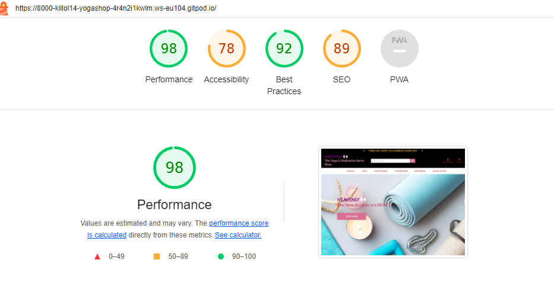
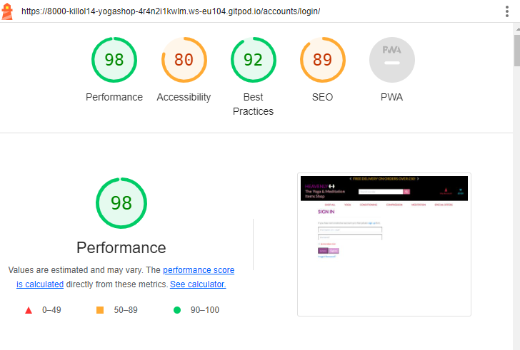

# Yoga_shop

## Milestone Project 4

This is my very First E-Commerce Website.
HEAVENLY Yoga Shop is about the Youg and Meditation Products Online Store. Where people can buy Yoga and Meditations Products.

## Live Project 

 
Heavenly Yoga Shop app can be found at (https://yoga-shop-8f3af1e13c14.herokuapp.com/)

 

## Repository  

(Project repository here)  
https://github.com/Killol14/Yoga_shop.git
 

## Table of Contents  

* User Experience

1.User stories

* Wireframes 

* Design  

1.Font Style  

2.Colour Scheme  

3.Images and Icons  

* Structure  

1.Navigation Bar  

2.Social Media Links (Footer)  

* Features  

1.Current Features 

* Technologies Used  

1.Languages used  

2.Frameworks and Library Programs  

* Testing  

* LightHouse 

* Other Tolls

* Deployment  

1. GitHub Pages  

* Credits  

1.Code  

2.Media  

3.Content  

4.Acknowledgements  

* Summary  
---------------------------------------------------------------------------------------------------

## User Experience

* This Is user friendly E-Commerce Website
* User can Register then Login and Logout
* User can Buy Yoga and Meditation Products
* Make it easy for the user to navigate the site.

## User Stories 
* As a user I want to buy some Yoga products
* As a user I want to search for specific Products Regarding Yoga and Meditation.
* As a user I want to able to Search Products.
* As a user I want to able to Search Products by price and sorts also category.
* As a user I want to be able to register my own account
* As a user I want to be able to log in to my account
* As a user I want to be able to log out of my account
* As a user I want to read Product Discription. 
* As a user I want to be able  to add product in my cart.
* As a user I want to be able to Remove Product.
* As a site admin I want to be able to Update Product.
* As a site admin I want to be able to secur Checkout
* As a site admin I want to be able to add Card detatils.
* As a site admin I want to be able to submit order.

## Wireframes  

### HEAVENLY Yoga Shop

### Ipad View

### Phone View

## Design 
With the user in mind, I wanted to create a website that user can buy Yoga and Meditation Products, user can search add, update, remove product Quantity , Size, and colour if available. user Can securlly Place the order and get the Notification as a real Online Yoga Product Store.
## Colour Scheme  

I chose this colour scheme for simplicity of Website and more like a Yoga Product. Calmness on Layout of the store.

.png)

## Images  

All Images are free Downloaded and its only the perpose for E-commerce store.

## Icons  

I used the social media on the footer Icons, which are located on the footer from, Font Awesome.  

## Structure  
I have used simple structure and navigation link for user friendly. I have used Bottstrap4 for this.
Register page, Checkout Page I have used Crispy Template From Django.
 

## Navigation Bar  

Navbar
Each page features a responsive Materialize navbar that’s collapsed to a burger icon when viewing on smaller screens. The navbar has a hover effect search bar, also above navbar there is baner. right hand side there are two click in for register , login and logout also cart for product total price.

 1. Users that are not logged in have the following pages in the navbar:

 * SHOP ALL
 * YOGA
 * COMPRESSION
 * MEDITATION
 * SPECIAL OFFERS
  AND ON My Account
* REGISTER
* LOGIN

 2. Users that are logged in have the following pages in the navbar:
  
 * SHOP ALL
 * YOGA
 * COMPRESSION
 * MEDITATION
 * SPECIAL OFFERS
  AND ON My Account
* LOGOUT
* MY PROFILE 

 3. Admin that are logged in have the following pages in the navbar:
 
   
 * SHOP ALL
 * YOGA
 * COMPRESSION
 * MEDITATION
 * SPECIAL OFFERS
  AND ON My Account
* LOGOUT
* MY PROFILE 
* PRODUCT MANAGEMENT

## Social Media Links (Footer) 

This includes the icons which take the user to the relevant social media page  

I have added social media links to Facebook, Instagram, Linkedin ,Twitter 

### Search bar
Allows the user to search for the Yoga & Meditation Products also user can search with any letter they like if product available with that name it will appear otherwise message will disply with No Products available.
### Product Card Layout 
Product Description page from Bootstrap4 and Crispyform from Django.
 

### Sign Up
The Sign up page features a simple form where the user can pick a username and a password. A request is made to Django to check if the username is already in use. If it's not being used a profile is created and the user is directed to their account page.

### Log In
The log in page also features a simple form where the user type their username and password to log in to their account. If the user doesn't exist or make a typo when writing, a toasts message appears that says "Incorrect Username and/or Password".

### Manage Poducts
When site admin is logged in there is a page to manage the Product with price and description. It's possible to either edit or delete the existing Product or to add new ones by admin only.
### Manage Categories
When site admin is logged in there is a page to manage the categories List. It's possible to either edit or delete the existing categories or to add new ones by admin only.
## Current Features  

I have created a website that is fully responsive on all screen sizes eg Tablet Mobile Laptop, by using the Media query and meta view port. This allows the texts and images to translate properly on these devices.  
## Database (Django and Elephant)

## LightHouse 

* LightHouse Home Page

* LightHouse Login Page

* LightHouse SignUp Page

* LightHouse Register Page

* LightHouse Product Page

* LightHouse Product Management Page

* LightHouse Add To cart Page

* LightHose CheckOut Pages

---------------------------------------------------------------------------
## Technologies Used  
## Languages used 

 * HTML, CSS, Javascript and Django

## Frameworks and Library Programs 

 * ElephantSQL
 * Amazon AWS
 * Pillow
 * AllAuth
 * Strip
 * pip
 * toast
 * Django
 * jQuery
 * boto3
 * Werkzeug
 * Bootstarp4
 * Google Fonts 
 * FontAwesome
####  Google Fonts 

Montserrat and Lato, were imported from google font and used throughout the website.

####  Font awesome 

I used the social media icons from font awesome  

##  Other Tools  
 * ElephantSQL - used as database for this project
 * Toast - used as a Eroor and Success Messages.
 * Django - used for Website FrameWork
 * Crispyform Templates - used for login-out, checkout, Product Form
 * Bootstrap4 - used for navbar and product layout
 * ASW - used for data saving
 * Stripe - used for card payment
 * Heroku - used to deploy the live site
 * GitPod - used for their IDE while building the website
 * GitHub - used to store repository
 * Balsamiq - used to create wireframes
 * DevTools - used to test responsiveness
 * Lighthouse - used to improve performance
 * ColorKit - used to create color palette.

 
## Testing 

----------------------------------------------------------------------------------------------------
## Deployment  

### How this Project was Deployed

 * Deployment to Heroku

  * This project was deployed through Heroku using the following steps:

 1. Navigate to Heroku and sign in

 2. On the top right corner there is a button that says "New". Click this button and choose the option "Create New App"

 3. Choose a name for the App and what region that are closest to your location, click "Create App"

 4. Click on the tab saying "Deploy" and select GitHub, Connect to GitHub

 5. Enter the name of your repository on GitHub and click search

 6. When the repository is found, click the "Connect" button

 7. Click on the tab saying "Settings" and then click on the button saying "Reveal config vars"

 8. Add these variables:

key: AWS_ACCESS_KEY_ID
key: AWS_SECRET_ACCESS_KEY
key: DATABASE_URL
key: EMAIL_HOST_PASS
key: EMAIL_HOST_USER
key: ENV_VARIABLE_NAME
key: HEROKU_POSTGRESQL_CYAN_URL
key: STRIPE_PUBLIC_KEY
key: STRIPE_SECRET_KEY
key: STRIPE_WH_SECRET
key: SECRET_KEY, value: (unique secret key for configuration)

 9. Click on the "Deploy" tab and scroll down to the section "Automatic Deployment"

 10. Choose the branch you want to deploy from and then click "Enable Automatic Deploys"

 11. 
### How To Run The Code Locally

To run this project locally you need to create the env.py file using your own variables since these are not provided for security reasons. To have the database connection you'll also need to create your own database collection and connect it to your project.

 1. Log in to Github.
 2. Navigate to the repository
 3. Click the tab that says "Code" and from the dropdown menu choose copy Git URL
 4. Open Git and type "git clone" in the terminal followed by the URL you just copied, press enter to create your local clone
 5. To install the packages listed in the requirements file type the following in the terminal: pip install -r requirements.txt
### Fork Project
 To fork the project follow these steps:

 1. Log in to Github
 2. Navigate to the repository
 3. Locate the "Fork" button on the top right corner of the page
 4. A duplicate of the original repository is now in your Github account
--------------------------------------------------
##### Cloning the Repository

1.Visit Hard Driver's GitHub Repository.
2.Click the "Code" dropdown box above the repository's file explorer.
3.Under the "Clone" heading, click the "HTTPS" sub-heading.
4.Click the clipboard icon, or manually copy the text presented: (https://github.com/Killol14/Roming-In-India.git)
5.Open your preferred IDE (VSCode, Atom, PyCharm, etc).
6.Ensure your IDE has support for Git, or has the relevant Git extension.
7.Open the terminal, and create a directory where you would like the Repository to be stored.
8.Type git clone and paste the previously copied text (https://https://github.com/Killol14/Roming-In-India.git) and press enter.
9.The Repository will then be cloned to your selected directory.

### Manually Downloading the Repository

1.Visit Hard Driver's GitHub Repository.
2.Click the "Code" dropdown box above the repository's file explorer.
3.Click the "Download ZIP" option; this will download a copy of the selected branch's repository as a zip file.
4.Locate the ZIP file downloaded to your computer, and extract the ZIP to a designated folder which you would like the repository to be stored.

### Opening the Repository

1.Open your preferred IDE (VSCode, Atom, PyCharm, etc).
2.Navigate to the chosen directory where the Repository was Cloned/Extracted.
3.You will now have offline access to the contents of the project.

## Summary 

Through the above languages and technologies, I have aimed to create a user friendly repository where people can add their own tips and advice on travelling to India. 

### Acknowledgements

Credit goes to my mentor Ronan, who helped overlook my project
Online youtube video for MongoDB Advise 
Code Institute walkthrough project. 

 
 

 
