# The HEAVENLY Yoga Shop
## Manual Testing

 * BUGS NOTE :- "This testing was written after resolving a few bugs on the Yoga Shop site. I had to revert Git commits a few times."
#### Test Scenario :-
--------------------------------
|What To Test |Test Step |Result |Expectations |Bug |
|-------------|----------|-------|-------------|----|
| Visitor to the website,| Open the webpage via the URL Github https://killol14.github.io/Yoga_shop/ | The webpage opens in under  5 seconds of fully loaded content. |  Github link worked and website loads as expected quickly.| No Bug Detected.|
| Shop now button| click on button| Product Page Opens | Works as expected | No Bug Detected.|
| My account button| hovering over the button, when not logged in| a drop down menu appears with register or Login | Works as expected | No Bug Detected.|
| Register | Sign Up Form Opens | UserName, Email and Passwords With Back To Login and Sign Up Button | Works as expected | No bug Detected. |
| Sign UP Button On Register Form | It Takes Onto diffrent Page | Message comes with verify Your Email Address | Works as expected | No Bug Detected. |
| Log In | it Logs In | With Success Message | Works as expected | No Bug Detected. |
| Search Bar | Used test Word and " Foam balance Pad Product opens " | Foam balance Pad has test word in description | Search bar Works as expected | No Bug Detected. |
| Category Bar | Clicked On All Category one by one | All Category and subcategory opens as normal | Works as expected | No Bug Detected. |
| By Price | On Side Bar Price (low to High) opens | after clicking on Low to High and High to Low | It Works as expected All Product with low and high price come up on screen | No Bug Detected. |
| By Category | On side Bar Category (A-Z) opens | All Product With category A-Z open after click on It. | Works as expected | No Bug Detected |
| All Products | Clicked On All Products | With Clicking On all Products (Opens All Product) | Works as expected | No Bug detected. |
| Add Product | Adding Any Product | Added Foam Roller with colour Red and Quantity 3 | It added Product with colour and quantity | works as expected | No Bug Detected. |
| Success Message | On Right side top small check out page opens | after clicking on go To Secure Checkout it takes you onto the Shopping Cart Page | works as expected | No Bug Detected. |
| Update and Remove | It Update and Remove Product from cart | when you updated quantity it updates product with success message and when you Click On Remove Product it Removes product from cart. | Update and Remove Product button works as expected | No Bugs Detected |
| Keep Shopping | Clicking On Keep Shopping Button on Checkout Page | It takes you On All Product Page | Works as expected | No Bug Detected. |
| Secure CheckOut | Secure Checkout button | when You click on Secure Checkout Button it takes you on checkout page for buyer details and delivery address | it opens with products summary and grand total | No Bug Detected. |
| Adjust cart | Adjust cart button | after clicking on Adjust card button it takes you on added Product cart page | it works as expected | No Bugs Detected. |

------------------
### Step by Step Testing Images

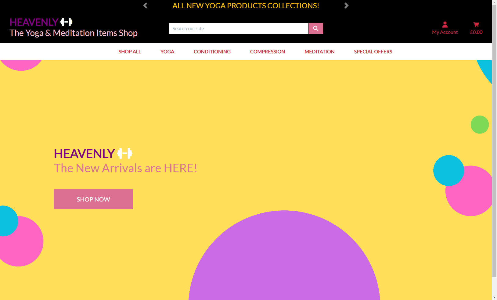

| Web Link | No Error |
|----------|----------|

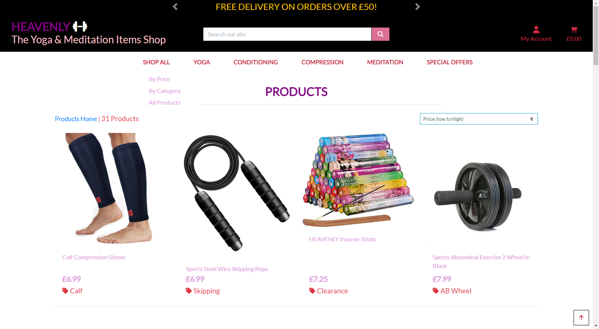

| Main Page Open By clicking Shop Now Button | No Error |
|----------|----------|

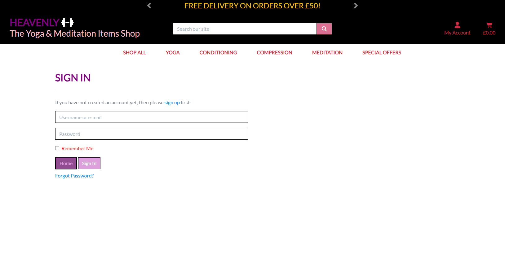

| Login with user and password  | No Error |
|----------|----------|

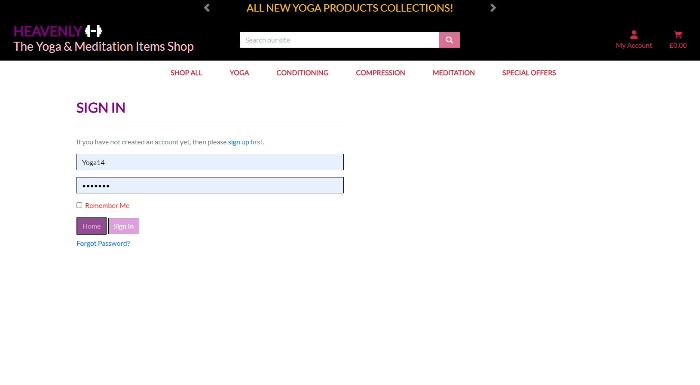

| Loged In with Successfully Loged In Message | No Error |
|----------|----------|

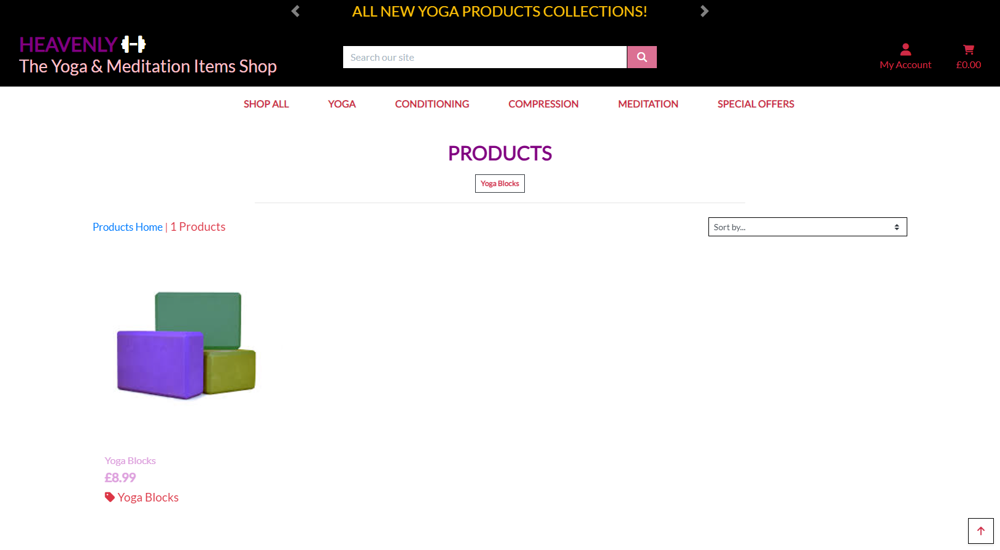
 
| Clicked On Yoga Block Product | No Error |
|----------|----------|

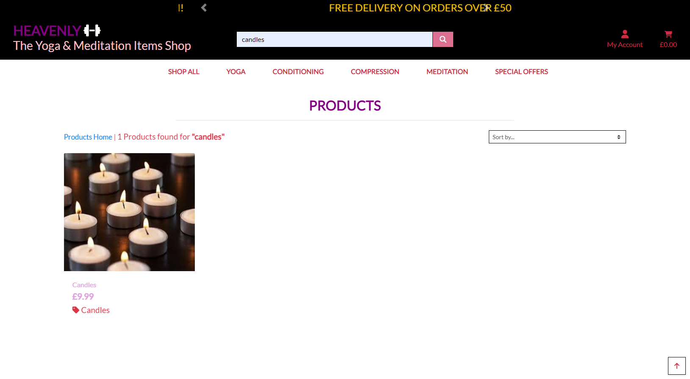

| Clicked On diffrent Product(andle)| No Error |
|----------|----------|

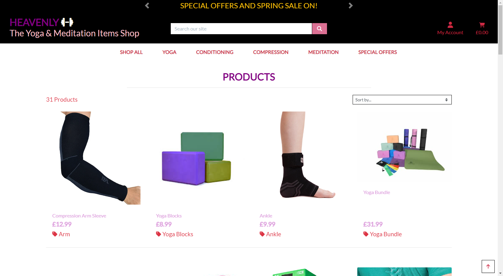

| Clicked On sideBar for sortby .. Product. It works as It should. | No Error |
|----------|----------|

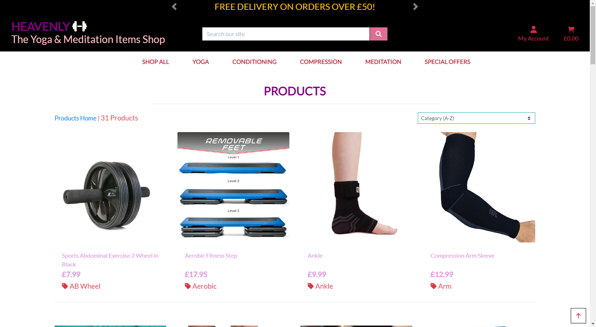

| Clicked On sideBar for Category A-Z .. Product. It works as It should.| No Error |
|----------|----------|

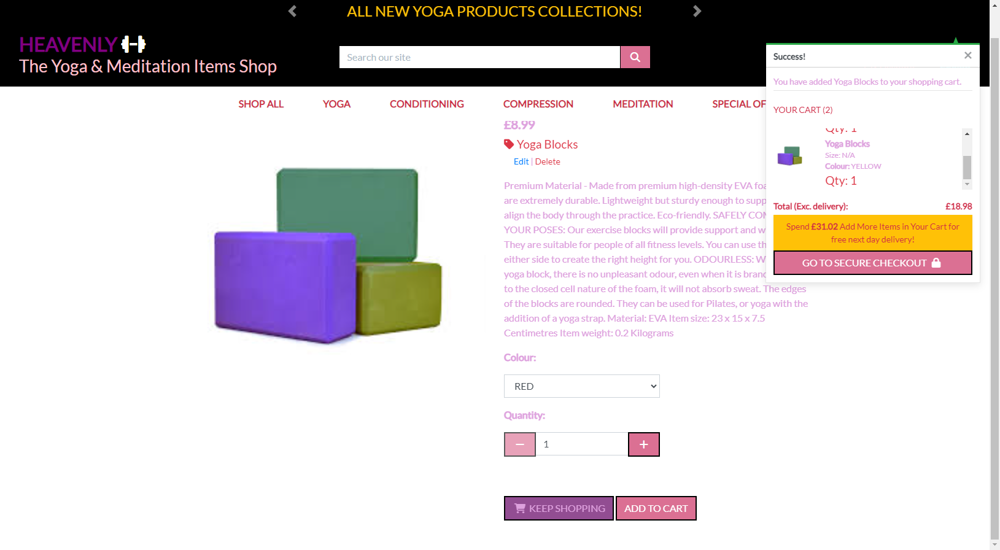

| Added YogaVlock to cart and  It works as It should with success message.| No Error |
|----------|----------|

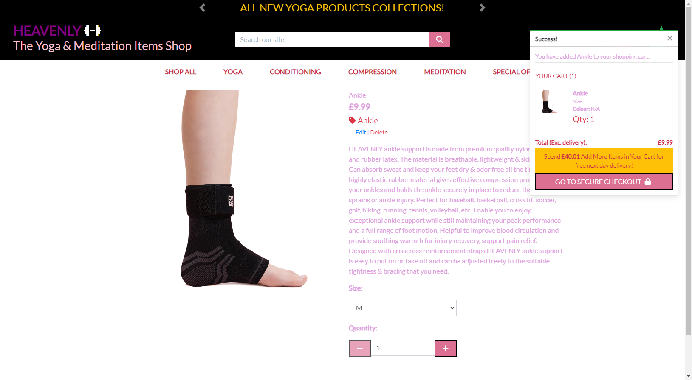

| Added YogaVlock to cart and  It works as It should with success message.| No Error |
|----------|----------|

| Clicked On Checkout Button, It takes you on checkout Page with added products and total quantity and prize with other products Informations | No Error |
|----------|----------|

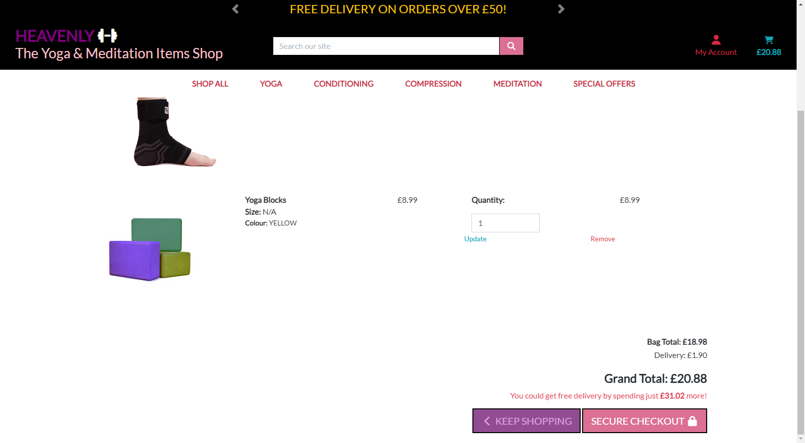

| Clicked On Secure Checkout Button, It works | No Error |
|----------|----------|

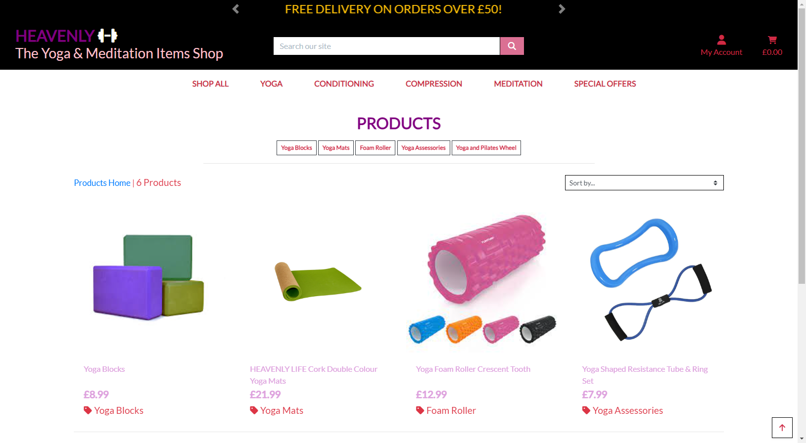

| Clicked On Navbar with category Name YOGA and ONLY All YOGA category products opens | No Error |
|----------|----------|

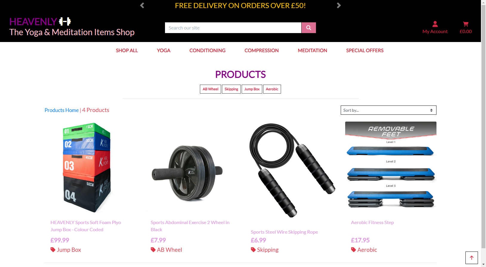

| Clicked On Navbar with category Name CONDITIONING and ONLY All CONDITIONING  category products opens | No Error |
|----------|----------|

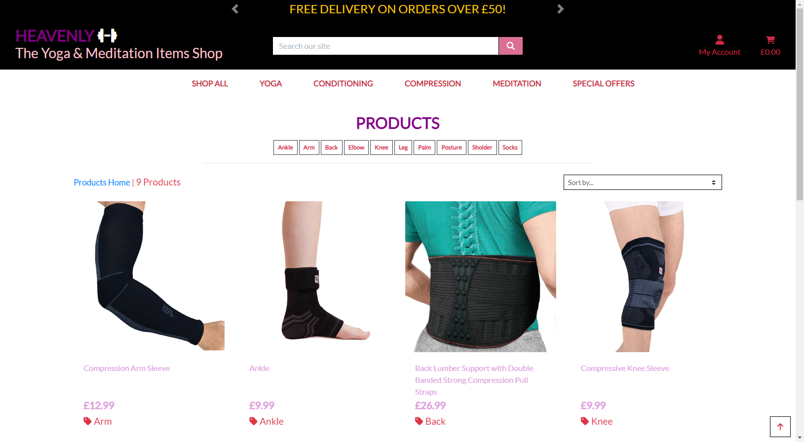

| Clicked On Navbar with category Name COMPRESSION and ONLY All COMPRESSION category products opens | No Error |
|----------|----------|

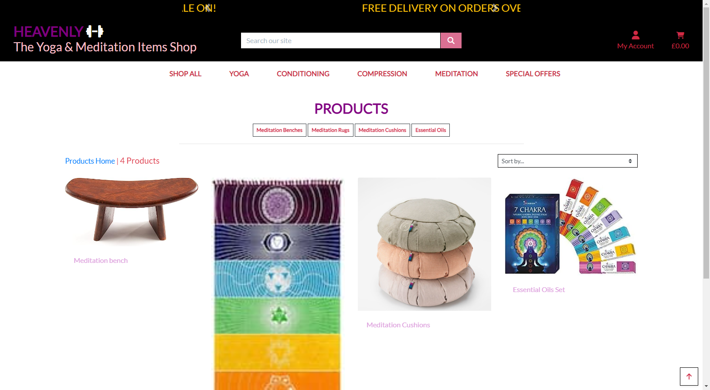

| Clicked On Navbar with category Name MEDITATION and ONLY All MEDITATION category products opens | No Error |
|----------|----------|

| Clicked On Navbar with category Name SPECIAL OFFERS and ONLY All SPECIAL OFFERS  category products opens | No Error |
|----------|----------|

| Clicked On Navbar with subcategory Name MEDITATION and ONLY All MEDITATION Subcategory products opens | No Error |
|----------|----------|

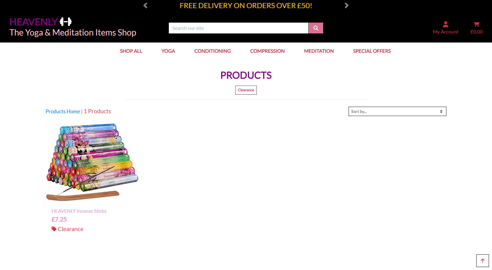

| Clicked On Navbar with subcategory Name CLEARANCE and ONLY All CLEARANCE Subcategory products opens | No Error |
|----------|----------|

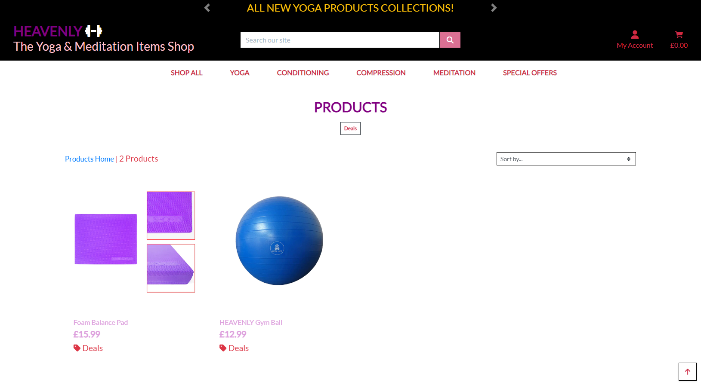

| Clicked On Navbar with subcategory Name DEAL and ONLY All DEAL Subcategory products opens | No Error |
|----------|----------|

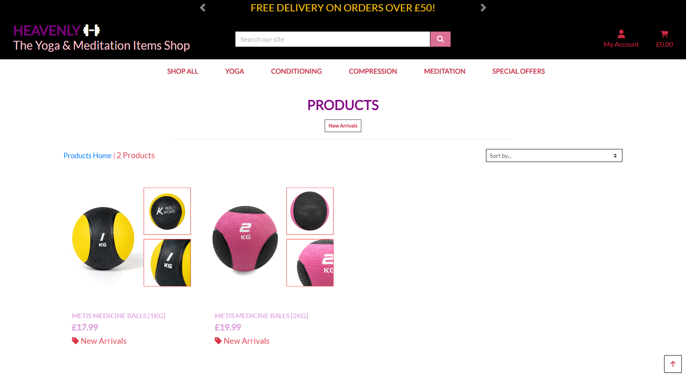

| Clicked On Navbar with subcategory Name NEW ARRIVALS and ONLY All NEW ARRIVALS Subcategory products opens | No Error |
|----------|----------|

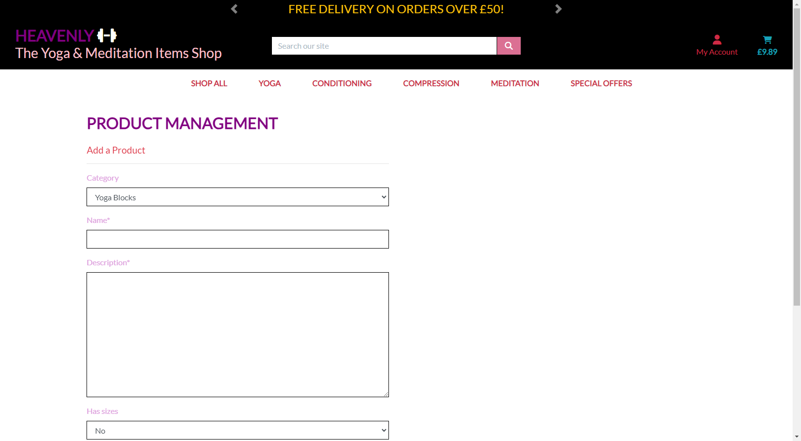

| Lastly As a Admin I Opened Product Management Page and It works And open as it should.| No Error |
|----------|----------|

-------------------------------------------------------------------------------------------------------------------------------------- 

* These are All Menual Testing steps work as normal Although I have Found one Small error as remove Button was not working with Some of the products Which is solved now.

Please Visit my HEAVENLY Yoga Shop On This Link ( https://yoga-shop-8f3af1e13c14.herokuapp.com/ ).

THANK YOU!
